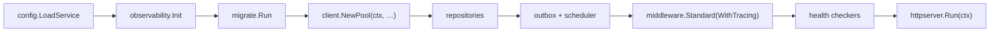

# Getting Started

This page takes you from zero to a running service skeleton built on dx-common-go.

## Prerequisites

- **Go 1.25+** (the library pins its toolchain in `go.mod`)
- **Docker** — only for integration tests and local infrastructure; the library itself has no runtime Docker dependency

## Installation

Inside the DX workspace, services consume the library through a `replace` directive pointing at the sibling checkout — one atomic version across the fleet:

```go title="go.mod"
require github.com/datakaveri/dx-common-go v0.0.0

replace github.com/datakaveri/dx-common-go => ../dx-common-go
```

Standalone consumers use a normal module require:

```bash
go get github.com/datakaveri/dx-common-go@latest
```

## Your first service in ~60 lines

The essential wiring: config → server → one route, with the platform's envelope and error taxonomy.

```go title="cmd/server/main.go"
package main

import (
	"context"
	"net/http"
	"os"
	"os/signal"
	"syscall"

	"github.com/go-chi/chi/v5"
	"go.uber.org/zap"

	"github.com/datakaveri/dx-common-go/config"
	"github.com/datakaveri/dx-common-go/dxerrors"
	"github.com/datakaveri/dx-common-go/health"
	"github.com/datakaveri/dx-common-go/httpserver"
	"github.com/datakaveri/dx-common-go/middleware"
	"github.com/datakaveri/dx-common-go/response"
)

type Config struct {
	LogLevel string            `mapstructure:"log_level"`
	Server   httpserver.Config `mapstructure:"server"`
}

func main() {
	logger, _ := zap.NewProduction()
	defer logger.Sync()

	cfg, err := config.LoadService[Config](config.ServiceOptions{
		Defaults: map[string]any{"server.port": 8080},
	})
	if err != nil {
		logger.Fatal("config", zap.Error(err))
	}

	// One signal context stops every component together.
	ctx, stop := signal.NotifyContext(context.Background(), os.Interrupt, syscall.SIGTERM)
	defer stop()

	sw := response.NewServiceWriter("urn:dx:demo:")

	r := chi.NewRouter()
	middleware.Standard(logger, 15e9)(r) // RequestID → RealIP → Logger → CORS → Compression → Recoverer → Timeout

	hh := health.NewHandler()
	r.Get("/healthz/live", hh.Live)
	r.Get("/healthz/ready", hh.Ready)

	r.Get("/hello", func(w http.ResponseWriter, req *http.Request) {
		name := req.URL.Query().Get("name")
		if name == "" {
			dxerrors.WriteError(w, dxerrors.NewValidation("name is required"))
			return
		}
		sw.Success(w, map[string]string{"greeting": "hello " + name}, "Success", "greeted")
	})

	if err := httpserver.New(cfg.Server, r, logger).Run(ctx); err != nil {
		logger.Fatal("server", zap.Error(err))
	}
}
```

Run it:

```bash
go run ./cmd/server
curl 'localhost:8080/hello?name=dx'
# {"type":"urn:dx:demo:success","title":"Success","detail":"greeted","result":{"greeting":"hello dx"}}
curl 'localhost:8080/hello'
# {"type":"urn:dx:as:InvalidParamValue","title":"Bad Request","detail":"name is required"}
```

You already have: structured request logging, request IDs, panic recovery, CORS, compression, timeouts, liveness/readiness probes, graceful shutdown on SIGTERM, and the platform's response envelope + error taxonomy.

## The full reference wiring

For everything else — Postgres pool with tracing, migrations, repositories, transactional outbox, scheduler, OpenTelemetry, OpenAPI validation, auth — copy the compiling template:

```bash
git clone https://github.com/datakaveri/dx-common-go
cd dx-common-go/examples/minimal-service
go run .
```

It demonstrates the canonical boot order:



CI compiles this template on every commit, so it is always in sync with the library's current API.

## Where next

- [Design Principles](/design-principles) — how the modules are meant to compose
- [Modules](/modules) — the catalogue; every page stands alone
- [Examples](/examples) — standalone usage through full service integration
