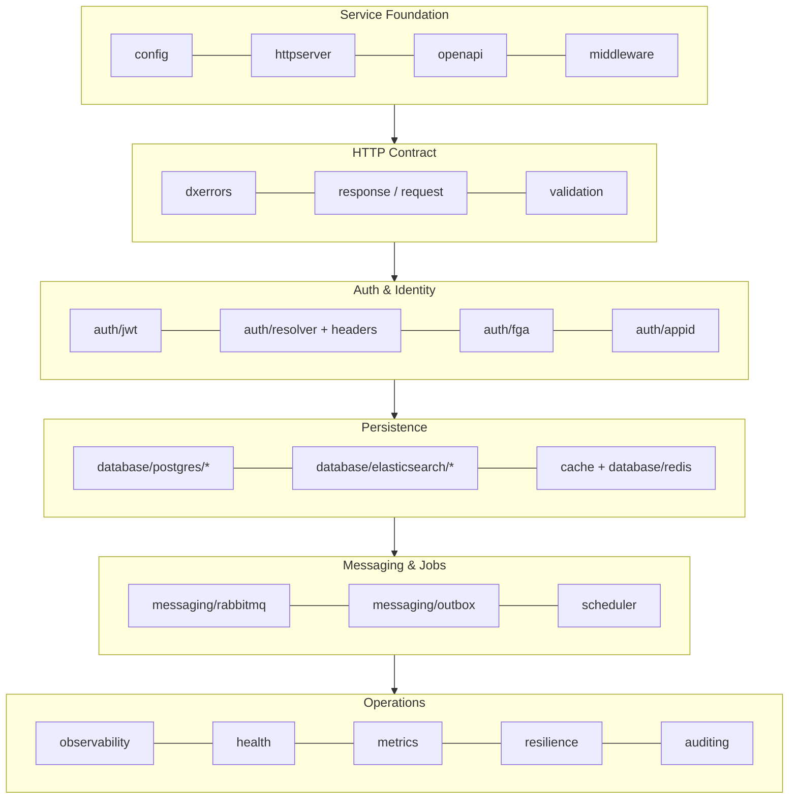

# dx-common-go

**dx-common-go is the shared Go foundation for every Data Exchange (DX) microservice.** It is a library of independent, reusable modules — configuration, HTTP serving, auth, persistence, messaging, storage, observability, resilience — each solving one cross-cutting concern so that a service imports the packages it needs and writes only domain code.

```go
import (
    "github.com/datakaveri/dx-common-go/config"
    "github.com/datakaveri/dx-common-go/httpserver"
    "github.com/datakaveri/dx-common-go/database/postgres/repository"
    "github.com/datakaveri/dx-common-go/dxerrors"
)
```

## What this library is — and is not

| It is | It is not |
|---|---|
| An **application framework** in intent: the library owns infrastructure, services own business logic | A monolithic framework you must adopt wholesale — every module works standalone |
| **Go-idiomatic in execution**: composition, generics, functional options, explicit APIs | Reflection magic, annotations, or inheritance hierarchies |
| **Business-free**: keys are opaque, payloads are the caller's, no domain vocabulary | A place for service-specific types, workflows, or contracts |
| Config-driven: behavior changes through configuration, never forks | Configurable to the point of ambiguity — one supported way per concern |

## Who uses it

All 15+ `dx-*-go` services — the gateway, authz/ACL, catalogue, marketplace, community, files, user, audit, notification, registry, credits, subscription, and the dataplanes — build on these modules. The [`examples/minimal-service`](https://github.com/datakaveri/dx-common-go/tree/main/examples/minimal-service) module is the compiling reference wiring, guarded by CI so it can never rot.

## How to read these docs

- **New to the library?** [Getting Started](/getting-started) walks from `go get` to a running service skeleton.
- **Evaluating a module?** Every page under [Modules](/modules) is self-contained: purpose, when to use it, key concepts, public API, configuration, examples, pitfalls.
- **Building a service?** [Design Principles](/design-principles) explains how modules compose, then [Examples → Service Integration](/examples/service-integration) shows the full boot sequence.
- **Upgrading?** [Migration Guides](/migration) document every breaking change wave with mechanical steps.

## The module map at a glance



Each edge above is a *typical composition order at boot*, not a dependency: modules do not depend on each other beyond a small set of leaf utilities, and any module can be used alone. See [Package Overview](/package-overview) for the real dependency rules.
