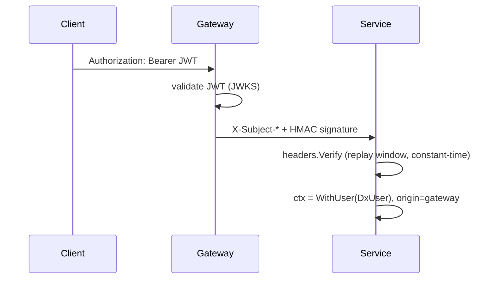

# Identity — auth, auth/jwt, auth/headers, auth/resolver

```go
import (
    "github.com/datakaveri/dx-common-go/auth"
    dxjwt "github.com/datakaveri/dx-common-go/auth/jwt"
    dxheaders "github.com/datakaveri/dx-common-go/auth/headers"
    "github.com/datakaveri/dx-common-go/auth/resolver"
)
```

## Purpose

How a request becomes a trusted `auth.DxUser` in context. Two paths, one resolver:

- **Behind the gateway (normal):** the gateway validates the client's JWT once, then forwards identity as HMAC-signed `X-Subject-*` headers. Services *verify a signature* instead of re-validating JWTs.
- **Direct (opt-in):** the service validates a Bearer JWT itself against Keycloak's JWKS.

`resolver.Middleware` arbitrates: HMAC preferred, JWT fallback, and a failed signature **never** falls through to JWT.

## Key concepts

- **`auth.DxUser`** is the resolved identity: ID (Keycloak sub), email, name, realm roles, organisation, delegation scopes. Stored/retrieved with `auth.WithUser` / `auth.UserFromContext`.
- **HMAC headers** (`auth/headers`): canonical string over subject fields + `issued_at`, HMAC-SHA256 with a shared secret, **replay window** (MaxAge 60s + skew), key-rotation list, constant-time compare.
- **JWT** (`auth/jwt`): RS256-pinned (algorithm-confusion rejected), JWKS auto-refresh, iss/aud enforced, leeway bounded to 300s. `Enabled: false` injects a synthetic dev user — and is **refused when `DX_ENV=production`**.
- **Origin tagging**: the resolver marks each request `OriginGateway` or `OriginDirect`; `RequireGatewayOrigin()` locks sensitive routes to gateway traffic.

## Public API

```go
// auth
type DxUser struct{ ID, Email, Name string; Roles []string; OrganisationID, OrganisationName, DelegatorID string; Scopes []DelegationScopeEntry }
func WithUser(ctx, user DxUser) context.Context
func UserFromContext(ctx) (DxUser, bool)

// auth/jwt
type Config struct{ JwksURL, Issuer, Audience string; LeewaySeconds int; RefreshInterval time.Duration; Enabled bool }
func (c Config) Validate() error
func New(cfg Config) (*Validator, error)                    // low-level: Validate(token) (*DxClaims, error)
func Middleware(cfg Config) (func(http.Handler) http.Handler, error)
func MustMiddleware(cfg Config) func(http.Handler) http.Handler

// auth/headers
type Config struct{ Secret []byte; PreviousSecrets [][]byte; MaxAge time.Duration }
func Sign(user auth.DxUser, cfg Config) (http.Header, error)   // gateway side
func Verify(h http.Header, cfg Config) (auth.DxUser, error)    // service side
func Apply(req *http.Request, signed http.Header)
func Middleware(cfg Config) func(http.Handler) http.Handler

// auth/resolver
type Config struct{ Headers dxheaders.Config; JWT dxjwt.Config; AllowDirect bool }
func Middleware(cfg Config) (func(http.Handler) http.Handler, error)
func MustMiddleware(cfg Config) func(http.Handler) http.Handler
func RequireGatewayOrigin() func(http.Handler) http.Handler
func OriginFromContext(ctx) (Origin, bool)   // OriginGateway | OriginDirect
```

## Usage

```go
r.Use(resolver.MustMiddleware(resolver.Config{
    Headers:     dxheaders.Config{Secret: []byte(cfg.InternalSecret)},
    JWT:         cfg.JWT,          // enables direct Bearer access when AllowDirect
    AllowDirect: cfg.AllowDirect,
}))

func (h *Handler) Create(w http.ResponseWriter, r *http.Request) {
    user, ok := auth.UserFromContext(r.Context())
    if !ok { dxerrors.WriteError(w, dxerrors.NewUnauthorized("no identity")); return }
    // user.ID, user.Roles, user.OrganisationID …
}

// Admin routes: gateway-only regardless of a valid JWT.
r.With(resolver.RequireGatewayOrigin()).Delete("/admin/items/{id}", h.AdminDelete)
```



## Best practices

- Never both paths off: the resolver refuses (`Middleware` errors) when `Headers.Secret` is empty and `AllowDirect` is false.
- Rotate the shared secret with `PreviousSecrets`: push the new secret, keep the old in the previous list one deploy, then drop it.
- Keep `MaxAge` tight (default 60s) — it is the replay-attack budget.

## Pitfalls

- A present-but-invalid signature is a hard 401 by design; "falling back" to JWT would let a caller smuggle identity past the signature check.
- Dev-mode JWT (`Enabled: false`) grants consumer+provider roles to *every* request — the production guard exists because that must never ship.

## Related modules

[auth/authorization](/modules/auth-authorization) (what the user may do), [middleware](/modules/middleware) (mount order), [auditing](/modules/auditing) (records the resolved identity).
