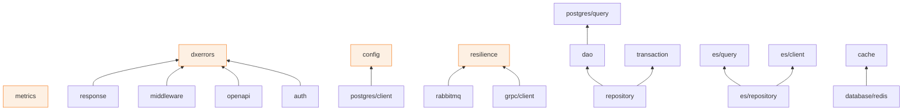

# Package Overview

Every importable package, its one-line purpose, and where it's documented. Import paths are relative to `github.com/datakaveri/dx-common-go`.

## Service foundation

| Package | Purpose | Docs |
|---|---|---|
| `config` | Type-safe env+YAML loader: `LoadService[T]`, `Validate()` hook | [config](/modules/config) |
| `httpserver` | Graceful HTTP(S) server: `Run(ctx)`, sane timeouts | [httpserver](/modules/httpserver) |
| `openapi` | Embedded OpenAPI 3 spec: request validation middleware + Swagger UI | [openapi](/modules/openapi) |
| `middleware` | `Standard` stack: RequestID, logging, CORS, compression, recovery, timeout, rate limiting, upload validation | [middleware](/modules/middleware) |

## HTTP contract

| Package | Purpose | Docs |
|---|---|---|
| `dxerrors` | The `*Error` taxonomy: codes → HTTP status + URN, cause-preserving mapping, writers | [dxerrors](/modules/dxerrors) |
| `response` | Standard envelope: `ServiceWriter`, `PageInfo`, paged responses | [response & request](/modules/response-request) |
| `request` | Canonical list-endpoint parser: page/size, allowlisted sort/filter, temporal | [response & request](/modules/response-request) |
| `validation` | Fluent request-body validator (strings, ints, email, UUID, URL, custom) | [validation](/modules/validation) |

## Auth & identity

| Package | Purpose | Docs |
|---|---|---|
| `auth` | `DxUser` identity + context accessors | [identity](/modules/auth-identity) |
| `auth/jwt` | Keycloak JWKS validation, RS256-pinned, claims → `DxUser` | [identity](/modules/auth-identity) |
| `auth/headers` | HMAC-signed `X-Subject-*` identity propagation (sign/verify, replay window) | [identity](/modules/auth-identity) |
| `auth/resolver` | HMAC-preferred / JWT-fallback resolution middleware, origin tagging | [identity](/modules/auth-identity) |
| `auth/authorization` | Role- and delegation-scope middleware (`ForRoles`, `ForScope`) | [authorization](/modules/auth-authorization) |
| `auth/fga` | OpenFGA client: `Check`, tuple writes, policy queries | [authorization](/modules/auth-authorization) |
| `auth/appid` | M2M app-credential flow: gRPC verification + Keycloak token source | [appid](/modules/auth-appid) |

## Persistence

| Package | Purpose | Docs |
|---|---|---|
| `database/postgres/client` | pgx pool lifecycle (`NewPool(ctx,…)`), tracers, slow-query log | [postgres](/modules/postgres) |
| `database/postgres/dao` | Generic `BaseDAO[T]`: CRUD, `Finder`, soft-delete filter, audit columns, optimistic locking | [postgres](/modules/postgres) |
| `database/postgres/repository` | Embeddable `Base[R]` facade — CRUD + DSL, transaction-propagation-aware | [postgres](/modules/postgres) |
| `database/postgres/query` | Parameterized SQL builder + condition DSL (14 operators, joins) | [postgres](/modules/postgres) |
| `database/postgres/transaction` | `InTransaction`, retryable tx, advisory locks, ctx propagation | [postgres](/modules/postgres) |
| `database/postgres/migrate` | golang-migrate wrapper: embedded SQL, per-service history table, config-driven search_path | [postgres](/modules/postgres) |
| `database/postgres/sqlcx` | Tx-aware `DBTX` provider for sqlc-generated queries | [postgres](/modules/postgres) |
| `database/elasticsearch/*` | Client, pure query DSL, `Repo[T]`, mapping/alias lifecycle, bulk indexing | [elasticsearch](/modules/elasticsearch) |
| `cache` | `Cache` contract + `GetOrLoad[T]` (singleflight) + in-memory impl | [redis & cache](/modules/redis-cache) |
| `database/redis` | Production `cache.Cache` (`NewCache`), typed helpers, `Mutex`, rate limiter | [redis & cache](/modules/redis-cache) |

## Messaging & jobs

| Package | Purpose | Docs |
|---|---|---|
| `messaging/rabbitmq` | `ReliablePublisher` (confirms, trace propagation), `ConsumerRunner` (reconnect, DLQ, dedup), topology client | [messaging](/modules/messaging) |
| `messaging/outbox` | Postgres transactional outbox: `PGStore` + `Dispatcher` | [messaging](/modules/messaging) |
| `scheduler` | In-process interval jobs: jitter, kick, advisory-lock singleton | [scheduler](/modules/scheduler) |
| `notify/email` | Email dispatch through the controlplane's RMQ email queue | [notify/email](/modules/notify-email) |

## Storage

| Package | Purpose | Docs |
|---|---|---|
| `storage/s3` | S3/MinIO object store: objects, listing, presign, multipart | [storage/s3](/modules/storage-s3) |
| `storage/s3/sts` | Short-lived scoped credentials (STS AssumeRole, prefix policies) | [storage/s3](/modules/storage-s3) |

## Operations & reliability

| Package | Purpose | Docs |
|---|---|---|
| `observability` | OpenTelemetry SDK lifecycle: `Init` → tracer provider + propagator | [observability](/modules/observability) |
| `metrics` | Prometheus handler + standard HTTP request metrics | [observability](/modules/observability) |
| `health` | Liveness/readiness aggregation + pgx/redis/rabbitmq/ES/object-store checkers | [observability](/modules/observability) |
| `resilience` | One `Policy` for retry + circuit breaker; HTTP client and gRPC interceptor wrappers | [resilience](/modules/resilience) |
| `auditing` | Platform audit records: context enrichment, async bounded publisher, opt-in middleware | [auditing](/modules/auditing) |

## Federation & transport

| Package | Purpose | Docs |
|---|---|---|
| `crypto/envelope` | Encrypt-then-sign message envelope (ECDH-ES + ECDSA, P-256) | [crypto & trust](/modules/crypto-trust) |
| `mtls` | Mutual-TLS configs with hot-swappable trust decisions | [crypto & trust](/modules/crypto-trust) |
| `trust` | Hot-swappable CA trust store + CRL checks | [crypto & trust](/modules/crypto-trust) |
| `grpc/client` | Standard gRPC dialing: resilience interceptor + tracing + keepalive | [grpc/client](/modules/grpc-client) |
| `auth/appid/appidpb` | Generated protobuf contract for app-id verification | [appid](/modules/auth-appid) |

## Tooling

| Package | Purpose | Docs |
|---|---|---|
| `dxtest/containers` | Testcontainers helpers: Postgres, Redis, RabbitMQ, MinIO — env-DSN override, skip without Docker | [dxtest](/modules/dxtest) |
| `cmd/dx` | CLI: `dx new migration`, `dx sqlc init` | [cli](/modules/cli) |

## Dependency shape

Leaves at the bottom import only the standard library (plus their driver); arrows point from importer to imported. Nothing imports "up", and the two database stores never import each other.
